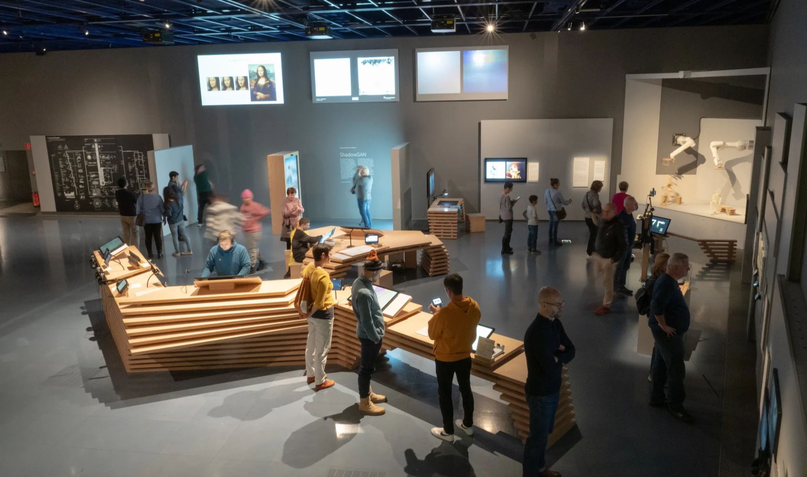
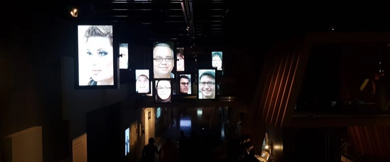

# ⋆⭒˚.⋆ Primera clase - presentación ⋆.˚⭒⋆

Jueves 12 Marzo 2026 

***

## Observaciones

Primera clase, comienzo a las 10:00. La lista pasa 15 min. tras la hora, tras eso queda ausente.
Se nos avisó que la comunicación será vía "discord" y "correo". Las sesiones escritas serán subidas en "Notion".

[Descripción del curso](https://field-mine-ef5.notion.site/Interacciones-Digitales-dis8948-31151d9cbb998078b0cdec5c39fa3ec8)

[Clase del día](https://field-mine-ef5.notion.site/Clase-1-Interacciones-Digitales-31451d9cbb99807c82f1e0f9d89fb77e)

En este espacio no se busca construir algo.
Se van a hacer abstracciones de sistemas (conjunto de elementos que son necesarios para la funcionalidad de una instalación digital).
Se puede utilizar igenieria inversa. Entender sistemas de interacciones digitales.

***

## ¿Qué es una interacción?

Es una ocasión, en la que 2 o más personas o cosas, se comunican o reaccionan entre ellas. - Oxford

Comprende reciprocidad (ida y vuelta), contextos (tecnología, investigación, lenguaje, etc), objetivos.

En una "interacción digital" se requiere que una de las partes sea un ente digital y otro humano. Por ejemplo: la interacción con el sistema digital puede ser a través de un teléfono.

En el curso se tendrá un efoque a interacciones de tipo poético, sensible o publicitario.

***

## La interacción como "Conversación" (Ranulph Glanville)

(Cibernetica) La verdadera interacción no es solo una reacción, sino un proceso circular en el que se "habla", se "escucha" y se "responde". 
Ello transforma la interacción en un bucle en el que la salida de la máquina se convierte en la entrada del humano y vice versa (bucle de retroalimentación dinámico). (Una interacción similar a una conversación con un chatbot).

## La interacción como "Agencia" (Janet Murray)

En su libro "Hamlet in the Holodeck", la escritora reemplaza el concepto de interacción por "Agencia". 
El ejercicio de la agencia dentr de un entorno procedimental. Si la eección del usuario no ambia el estado del mundo digital, es solo una actividad y no una interacción verdadera.

## Ambientes

Entornos responsivos. Un tipo de espacio en la que la interacción debe ocurrir sin disositivos perifericos (mandos, controles, etc), sino que la presencia el usuario y su cuerpo genera la interacción.
Una relación estética entre la acción del usuario y la respuesta del sistema.

***

### Encargo 01: 

Investigar, buscar y encontrar un sistema de interacción digital que se enmarque en los tipos de sistemas presentados durante esta clase.
Escribir un blog post describiendo el sistema de interacción digital en términos espaciales, tecnológicos, materiales y experienciales.

### **¿Qué es la inteligencia artificial?**

Esta es la pregunta que da inicio a la exhibición “Understanding AI”.

En esta muestra, el espacio se compone de instalaciones interactivas que utilizan distintos tipos de inteligencia artificial, permitiendo a los visitantes no solo comprender su funcionamiento, sino también interactuar con ella y dejar su propia huella en el recorrido. A su vez, propone una reflexión crítica sobre el impacto de estas tecnologías en la vida cotidiana y en la sociedad contemporánea.

Esta experiencia ha sido organizada por el [Ars Electronica Center](https://ars.electronica.art/news/en/), un centro cultural reconocido como el “Museo del futuro”, que trabaja con una multiplicidad de disciplinas vinculadas a los nuevos medios y tecnologías emergentes para la creación de obras y experiencias expositivas.

Con este antecedente es que se procede a analizar una de las obras que participa.

### [**What A Ghost Dreams Of (2019)**](https://www.howeb.org/works/what-a-ghost-dreams-of-2019/)

> *¿Qué proyectamos los humanos en el equivalente digital que estamos creando con IA? Es conocer nuestro mundo sin conocimientos previos y generar datos que nunca existieron. ¿Cuáles son los efectos de usar IA para producir obras de arte? ¿Quién tiene los derechos de autor? ¿Y qué sueña la IA, el "fantasma", y qué significa eso para nosotros como seres humanos?*
> 

“Con lo que sueña un fantasma” (ESP) se trata de una instalación interactiva que aborda la vigilancia digital (por ende, la privacidad), además de la relación entre humanos y la IA en cuánto a la producción de imágenes digitales. La obra utiliza el concepto de “fantasma” como una metáfora de un fenómeno nuevo e incomprensible, cuyo impacto genera emociones que van desde el miedo hasta el asombro. Esta idea se establece en paralelo con los avances tecnológicos actuales y las transformaciones que estos producen en nuestra vida cotidiana.

El registro de este “ente” se realiza mediante cámaras y sistemas de algoritmos de detección manejados por una inteligencia artificial, los cuales realizan capturas y almacenamiento de los rostros de los visitantes. Dicha información es utilizada para la creación de imágenes de personas que no existen, sino que son composiciones faciales compuestas por los rasgos de quienes recorren el montaje.

De este modo, la obra pone en evidencia cómo la IA puede construir identidades a partir de información real, cuestionando los límites entre lo auténtico y lo artificial en un mundo cada vez más interconectado, cuya accesibilidad a estos recursos se encuentra cada vez más extendido.

A través de este proceso, la instalación invita a reflexionar sobre el uso de nuestros datos, la vigilancia constante y el rol de la inteligencia artificial en la construcción de nuevas formas de representación e identidad en la era digital.

### Elementos del sistema

#### 1. Espacio y entorno

La obra se encuentra presente en un espacio de tránsito, cuyo recorrido comienza con unas escaleras que invitan a que la persona descienda hasta un sótano. Al bajar existe un contraste entre la oscuridad y la iluminación: este efecto permite destacar la obra en sí y poder guiar al visitante al resto de la exhibición. Al ser un espacio extenso y sin muros se genera una sensación de vigilancia constante por parte del montaje.

#### 2. Tecnologías existentes

Las tecnologías utilizadas en la muestra se centran en “Sistemas de Reconocimiento Facial” y “Redes Generativa Adversarial (GAN)”. La primera se utiliza para detectar rostros para capturar aquellos rasgos que lo componen, mientras que las “Redes neuronales” discriminan la información para próximamente utilizarla para generar al “fantasma”. Ello logra evidenciar cómo estas “máquinas” pueden analizar, aprender y recombinar datos visuales.

#### 3. Materiales y recursos

Acerca de los objetos utilizados para el montaje se encuentran los siguientes:

- Pantallas
- Cámaras con reconocimiento facial
- Sensores de detección
- Computadores
- Sistemas y software para el procesamiento de datos
- Cables

Cabe mencionar que en su totalidad la obra es de carácter digital, cuya esencia es de tipo intangible al requerir de elementos externos para ser expuesta.

#### 4. Interacción y experiencia

Esta obra requiere de la presencia activa de los visitantes para su funcionamiento, puesto que está diseñada para generar intriga, duda y temor en quienes recorran la instalación. 

Al inicio, se presenta un gran ojo en una pantalla que da la bienvenida, recordando que ser observado forma parte de la experiencia. A continuación, una cámara detecta la presencia de los visitantes y captura sus rostros, los cuales son procesados por un sistema de inteligencia artificial. A medida que se avanza en el recorrido, aparecen múltiples pantallas que exhiben imágenes de personas generadas a partir de la combinación de rasgos de quienes han transitado por la muestra, acompañadas de información contextual sobre el proceso.

La interacción no requiere acciones complejas, sino únicamente la presencia física del visitante, quien pasa de ser espectador a convertirse en parte del sistema. Esta dinámica genera una experiencia que puede provocar sensaciones de exposición, inquietud y curiosidad, al evidenciar cómo la propia imagen es capturada, analizada y transformada por la tecnología.

### Fuentes de información

- https://ars.electronica.art/center/en/understanding-ai/
- https://ars.electronica.art/panic/en/view/understanding-ai-22338ddb450c80018d95cb4c35be99b8/
- https://www.howeb.org/works/what-a-ghost-dreams-of-2019/
- https://kairus.org/linda/index.php/2019/09/23/ars-electronica-2019-understanding-ai/

***

Concepto tecno-creativo 

## Links varios

- https://itp.nyu.edu/itp/
- https://designsystems.international (identidad processing)
- https://processing.org
- https://www.localvariablestudio.com
- https://es.wikipedia.org/wiki/Poème_électronique
- https://es.wikipedia.org/wiki/Edgar_Varèse
- https://www.guggenheim.org/artwork/9536
- https://sarahrothberg.com/SCROLL-O-METER
- https://borderless-planets.teamlab.art/en/
- https://www.error404.cl/periferia/
- https://youtu.be/Mgy1S8qymx0?si=8Mjs__TFFcbyzRo9
